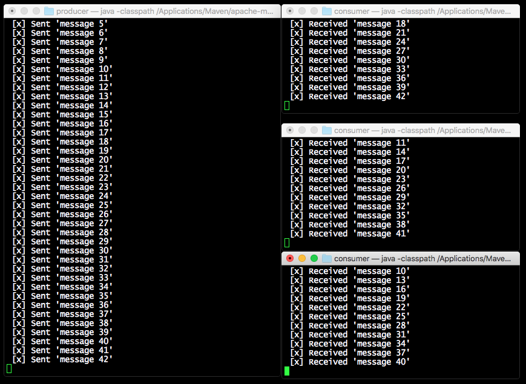

# Spring Boot e RabbitMQ (Task Queue - Round Robin)

- Eseguire RabbitMQ: `docker-compose up`
- Eseguire un producer: `cd producer && mvn spring-boot:run`
- Eseguire un consumer: `cd consumer && mvn spring-boot:run`
- RabbitMQ Dashboard (*guest:guest*): http://localhost:15672

